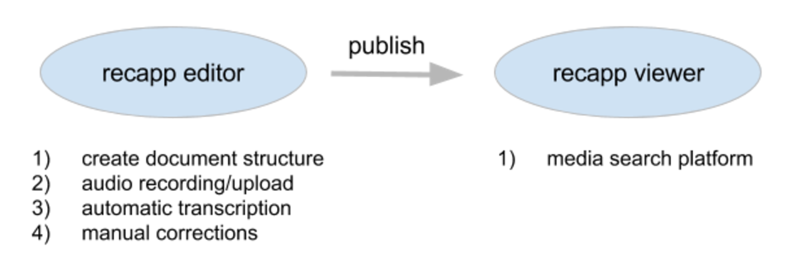
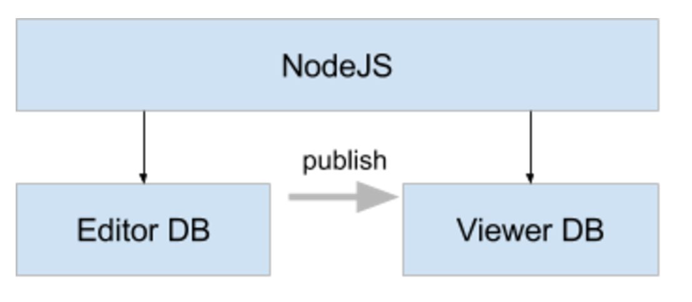
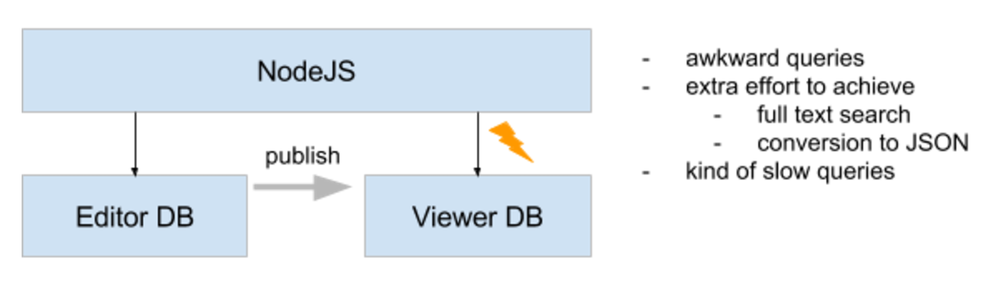
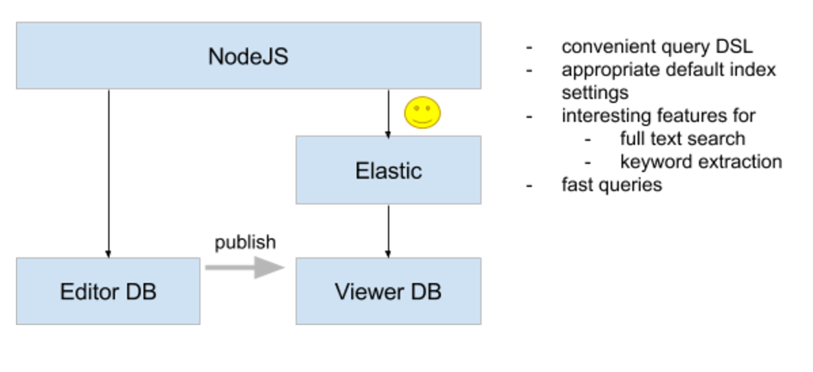

## Interactive multimedia archive powered by

<div style="display: flex; flex-direction: column; "> 
  

  <a href="https://twitter.com/andikobler" target="_blank" style="margin-top: 400px">@andikobler</a> <!-- .element: style="margin-top: 100px;" -->
</div>


## Agenda
* Architecture overview
* Demo
* Elastic features
* Hurdles
* Some more tips


## recapp application




## Architecture




## Architecture




## Architecture




## Demo

* debates of Grand Conseil de Valais:
  <a href="https://vs.recapp.ch" target="_blank">vs.recapp.ch</a>


### Elastic features

* tour through Elastic features that
  * create a nice search experience with litte effort
  * caused AHA effects when I started with elastic


### Elastic features: search
* simple search queries: match, prefix, filter

```json
GET /recapp_viewer/_search
{
    "query": {
          "match": {"segmentTranscription": "amendement"}
    }
}
```

```json
GET /_search
{ 
    "query": {
        "prefix" : { "segmentIndex" : "2016-09-" }
    }
}
```
* fuzzy search possible (e.g. to catch misspelling) <!-- .element: class="fragment" data-fragment-index="1"-->
  * can be confusing, we prefer: autocompletion or "did you mean" <!-- .element: class="fragment" data-fragment-index="1"-->
* <a href="https://www.elastic.co/guide/en/elasticsearch/reference/current/query-dsl.html" target="_blank">query DSL</a> <!-- .element: class="fragment" data-fragment-index="1"-->


### Elastic features: search
* define custom analyzer
  * remove stop words, normalisation (Ä -> a, etc.)
  * mapping links document field to analyzer
  * possible: different analyzer at index and search time

```json
{
  "analyzer": {
    "searchAnalyzer": {
        "type": "custom",
        "filter": [
          "fr-stopwords", "de-stopwords",
          "lowercase", "asciifolding"
        ],
        "tokenizer": "letter"
    }
  }
}
```
<a href="https://www.elastic.co/guide/en/elasticsearch/reference/current/analysis-custom-analyzer.html" target="_blank">custom analyzer</a>


### Elastic features: search
* highlight search term in response

```json
GET /recapp_viewer/_search
{
    "query": {
          "match": {"segmentTranscription": "Lesung"}
    },
    "highlight": {
        "fields": {
            "objectTitle.de": {},
            "objectTitle.fr": {}
        }
    }
}
```
<a href="https://www.elastic.co/guide/en/elasticsearch/reference/current/search-request-highlighting.html" target="_blank">highlighting</a>


### Elastic features: search
* multi match query
  * search in title, description and in transcription field
  * <a href="https://www.elastic.co/guide/en/elasticsearch/reference/1.4/query-dsl-multi-match-query.html" target="_blank">multi match query</a>


### Elastic features: analyzer
* multi fields
  * different indeces for different requirements
  * different analyzers on same document property: <a href="https://www.elastic.co/guide/en/elasticsearch/reference/current/multi-fields.html" target="_blank">Elastic multi fields</a>
  * adressing: `segmentTranscription.tags`

```json
{
  "segmentTranscription": {
    "type": "string",
    "analyzer": "searchAnalyzer",
    "fields": {
      "tags": {
        "type": "string",
        "analyzer": "tagAnalyzer"
      }
    }
  }
}
```


### Elastic features: aggregation
* aggregations
  * list of speakers that spoke the most

```json
POST /recapp_viewer/_search?pretty
{
    "size": 0,
    "query": {
        "match": { "sessionDate" : "2016-09-01"}
    },
    "aggs" : {
        "top_speaker_durations" : {
            "terms" : {
                "field" : "deputyFullname",
                "order" : { "durations_per_speaker" : "desc" },
                "size" : 3
            },
            "aggs": {
                "durations_per_speaker" : {
                    "sum": { "field": "segmentDuration" }
                }
            }
        }
    }
}
```


### Elastic features: aggregation
* significant terms

```json
POST recapp_viewer/_search?pretty
{
  "size": 0,
  "aggs": {
    "tags": {
      "significant_terms": {
        "field": "segmentTranscription.tags"
      }
    }
  },
  "query": {
    "filtered": {
       "filter": {
           "term": {
              "deputyId": 703
           }
       }
    }
  }
}
```


### Elastic features: aggregation
* suggesters to correct misspelled words

```json
GET recapp_viewer/_suggest
{
    "correction" : {
      "text" : "tourisus",
      
      "term" : {
        "field" : "segmentTranscription.tags",
        "min_doc_freq" : 2,
        "prefix_length": 1,
        "suggest_mode": "missing"
      }
    }
}
```
<a href="https://www.elastic.co/guide/en/elasticsearch/reference/current/search-suggesters.html" target="_blank">suggesters</a>


### Elastic features: maintenance

* aliases for uninterrupted reindexing
  * existing documents in index cannot be modified
  * rebuild entire index and switch alias

```json
POST /_aliases
{
    "actions" : [
        { "add" : { "index" : "recapp_viewer_alias-1", "alias" : "recapp_viewer" }}
    ]
}
```
<a href="https://www.elastic.co/guide/en/elasticsearch/reference/current/indices-aliases.html" target="_blank">aliases</a>


### Hurdles

* in general no real big hurdles, just...

* be aware of elastic's memory behaviour: <!-- .element: class="fragment" data-fragment-index="1"--> <a href="https://www.elastic.co/guide/en/elasticsearch/guide/current/heap-sizing.html" target="_blank">heap sizing</a> <!-- .element: class="fragment" data-fragment-index="1"-->
* do not think the classic DB-way - create a fresh elastic mindset <!-- .element: class="fragment" data-fragment-index="2"-->
* get the overview of the query DSL <!-- .element: class="fragment" data-fragment-index="3"-->
  * what query type to use? (term, match, prefix, filtered, ...) <!-- .element: class="fragment" data-fragment-index="3"-->
* fields were automatically indexed, but I needed it raw <!-- .element: class="fragment" data-fragment-index="4"-->
```json 
  "index": "not_analyzed"
```
<!-- .element: class="fragment" data-fragment-index="4"-->
* address nested properties <!-- .element: class="fragment" data-fragment-index="5"-->
```json
  "parent": {"properties": {"child": { "type": "string"}}}
```
 <!-- .element: class="fragment" data-fragment-index="5"-->


### Some more tips
* explore elastic with Sense Chrome Plugin 
  * <a href="https://chrome.google.com/webstore/detail/sense-beta/lhjgkmllcaadmopgmanpapmpjgmfcfig" target="_blank">Sense Plugin</a>
* use /_analyze to investigate analyzers <!-- .element: class="fragment" data-fragment-index="1"-->
```json
POST recapp_viewer/_analyze?field=segmentTranscription.tags
{
    "l'amendement cinquante cinq monsieur le conseiller haut-valais"       
}
```
<!-- .element: class="fragment" data-fragment-index="1"-->

* fetch more than 10 results <!-- .element: class="fragment" data-fragment-index="2"-->
```json
POST /recapp_viewer/_search?pretty
{
    "size": 100
}
```
<!-- .element: class="fragment" data-fragment-index="2"-->


## Wrap up
* fast search
* POC system could be setup very quickly (1-2 days) <!-- .element: class="fragment" data-fragment-index="1"-->
  * go gradually towards more sophisticated search functionality <!-- .element: class="fragment" data-fragment-index="1"-->
* many features out of the box (analyzers, filters, queries, ...) <!-- .element: class="fragment" data-fragment-index="2"-->